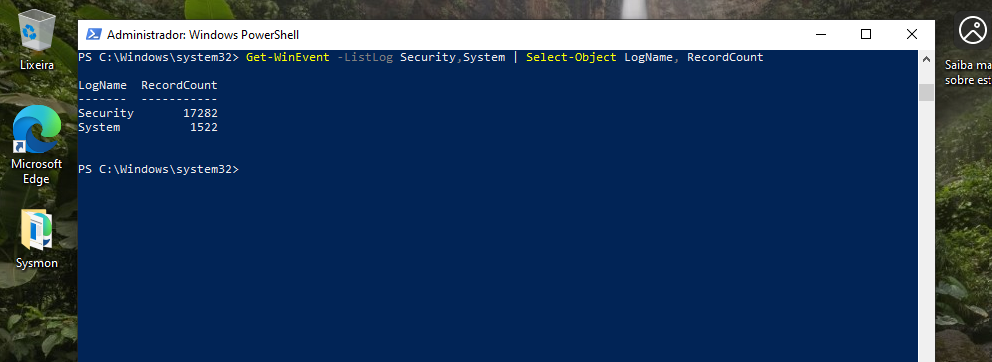
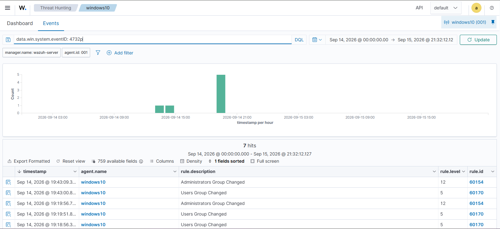
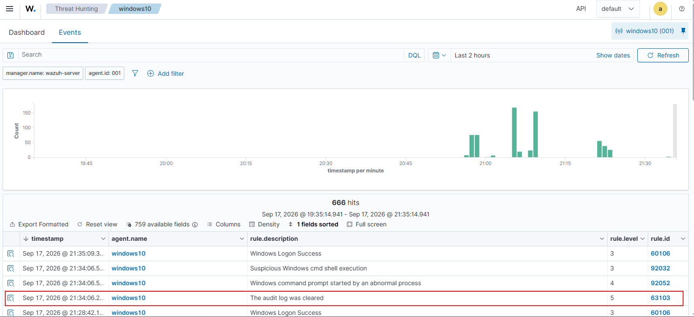

# Simulação de Limpeza de Log de Auditoria (T1685.005 / T1070) e a Resiliência da Centralização de Logs

## Objetivo

Simular a técnica de Defense Evasion "Clear Windows Event Logs" via Atomic Red Team e validar a resposta do pipeline de detecção do Wazuh a esse comportamento. O objetivo central não é apenas confirmar que a limpeza gera um alerta, mas demonstrar a tese que justifica a existência de um SIEM: uma vez que os eventos foram enviados ao servidor central, apagá-los da máquina de origem não os remove da análise. A investigação também exercita a distinção entre o rótulo MITRE que o framework de simulação atribui a um teste e o rótulo que o motor de detecção atribui ao alerta correspondente.

- **Técnica testada**: T1685.005-1 — "Clear Logs" (`wevtutil cl Security`).
- **Nota de nomenclatura**: o teste foi originalmente catalogado no Atomic Red Team como T1136.001... (ver seção Processo). No momento deste teste, o caminho válido no repositório é `atomics/T1685.005/`.

## Processo

### 1. Obstáculo de instalação: renumeração da técnica no MITRE

A intenção inicial era testar a técnica sob o ID T1070.001 ("Clear Windows Event Logs"), conhecido de materiais mais antigos. Duas falhas encadeadas revelaram um problema mais interessante do que um simples erro de digitação:

Primeiro, a tentativa de baixar a biblioteca completa de atomics (`Install-AtomicsFolder`) falhou de forma silenciosa. Com a flag `-Verbose`, a causa apareceu: o download do `master.zip` retornou um payload de 0 bytes (resposta de -1 byte do GitHub). Sem conteúdo para extrair, o processo de extração travava indefinidamente, deixando uma biblioteca parcial. Diagnóstico registrado: instalação sem erro explícito não é prova de sucesso — a validação exige confirmar o artefato final (`Test-Path` no arquivo esperado), não a ausência de mensagem de erro.

Optou-se então por baixar apenas o YAML da técnica sob demanda, uma decisão de arquitetura que reduz espaço em disco, exposição ao Windows Defender e pontos de falha. Porém, o download direto de `atomics/T1070.001/T1070.001.yaml` retornou 404. A causa raiz não era rede: a técnica havia sido reorganizada no framework MITRE. O antigo T1070.001 foi realocado como **T1685.005** (Disable or Modify Tools: Clear Windows Event Logs). O arquivo válido, baixado sob demanda, foi `atomics/T1685.005/T1685.005.yaml`.

Lição: IDs de técnica do MITRE ATT&CK não são estáveis ao longo do tempo — são renumerados e realocados entre táticas conforme o framework evolui. Um analista precisa validar o mapeamento atual na fonte, não confiar na memória ou em documentação datada.

### 2. Baseline pré-teste

Antes de executar, o estado do log Security foi registrado para permitir uma comparação objetiva de antes e depois:

- Contagem de eventos no log Security: **17282**.
- Eventos de referência escolhidos (remanescentes do teste T1136.001, dia 14/09): Event ID 4732 (`eventRecordID` 16552 e 16553) e 4738 (`eventRecordID` 16550).

Esses eventos de referência foram localizados e confirmados no dashboard do Wazuh antes da limpeza, estabelecendo que existiam nos dois lugares — origem e SIEM — no ponto de partida.



### 3. Execução e verificação local

```powershell
Invoke-AtomicTest T1685.005 -TestNumbers 1 -InputArgs @{"log_name"="Security"}
```

Verificação imediata na própria máquina confirmou a hipótese:

- `RecordCount` do log Security despencou de 17282 para **1**.
- O único evento restante era o **Event ID 1102** ("O log de auditoria foi apagado"), gerado pelo próprio Windows imediatamente após a limpeza, registrando a conta que executou a ação (`windows10` em `DESKTOP-OBOJBDU`, com SID e Logon ID).
- Os eventos de referência 4732/4738 não retornaram mais nenhuma busca local — foram apagados da origem.

Ponto central da técnica: o atacante consegue apagar o histórico, mas não consegue apagar o registro do próprio ato de apagar. O 1102 é gerado pelo sistema operacional depois que o log já foi zerado, tornando-se a assinatura inevitável dessa técnica.

### 4. Confirmação no Wazuh — duas frentes

**Frente 1 — sobrevivência dos eventos apagados.** Buscando por `data.win.system.eventID: 4732` na janela do dia 14/09, os eventos de referência apareceram intactos no Threat Hunting: os alertas 60154 (Administrators Group Changed, level 12) e 60170 (Users Group Changed), com o mesmo `eventRecordID` anotado no baseline. Esses eventos foram apagados da Windows 10 minutos antes e permaneceram no SIEM — a demonstração central do documento.

Detalhe de correlação que a técnica obriga a enfrentar: o `RecordId` local é um contador que zera quando o log é limpo, deixando de existir na origem. A reconciliação dos eventos antigos no Wazuh se faz por `@timestamp` + `data.win.system.eventID` + `data.win.system.eventRecordID`, campos que ficam congelados no índice no momento do envio, independentes do estado posterior da máquina.



**Frente 2 — o alerta da limpeza.** O alerta correspondente à limpeza foi localizado em torno do horário de execução:

| Campo | Valor |
|---|---|
| `rule.id` | 63103 |
| `rule.description` | The audit log was cleared |
| `rule.level` | 5 |
| `data.win.system.eventID` | 1102 |
| `rule.mitre.id` | T1070 |
| `rule.mitre.tactic` | Defense Evasion |
| `rule.mitre.technique` | Indicator Removal |

Duas observações de análise:

**Duas fontes de telemetria testemunhando o mesmo ato.** No mesmo minuto do alerta 63103, o dashboard registrou também os alertas 92032 (Suspicious Windows cmd shell execution, level 3) e 92052 (Windows command prompt started by an abnormal process, level 4). Esses dois são o próprio `wevtutil` sendo executado, capturado pelo Sysmon como criação de processo. O Windows Security registrou "o log foi limpo" (63103, via evento 1102), enquanto o Sysmon registrou "um processo anômalo rodou um comando" (92032/92052). O mesmo ato de defesa evasiva foi visto por dois ângulos independentes — reforço da lição, já registrada no T1136.001, de que fontes de log distintas convivem no mesmo host com coberturas diferentes.

**Divergência de rótulo MITRE.** O teste é catalogado como T1685.005, mas o Wazuh mapeia o alerta como T1070 (Indicator Removal) — a técnica-pai, mais genérica, no lugar da subtécnica granular. É a mesma distinção observada no T1059.001 (rótulo do teste ≠ rótulo do detector), agora com uma camada adicional: o próprio ID que o framework usa para a técnica mudou (T1070.001 → T1685.005), enquanto o ruleset do detector ainda referencia a técnica-pai T1070. O analista precisa reconciliar três nomenclaturas — a do teste, a do detector e a histórica.



### 5. Ausência de cleanup: uma propriedade da técnica, não um esquecimento

Diferente do T1136.001, cuja rotina de cleanup removia a conta criada, o T1685.005 não possui comando de cleanup nativo — e isso é coerente, não uma falha. Uma rotina de cleanup existe para reverter o que um teste **adiciona** ao sistema (uma conta, uma chave de registro, um arquivo). Este teste não adiciona nada; ele subtrai. O "resíduo" a ser limpo é a própria ausência dos logs, que nenhum comando reconstrói.

A consequência prática é que a responsabilidade pela reversibilidade se desloca do comando de cleanup para o planejamento prévio do analista: a única volta ao estado original é o snapshot tirado antes do teste. Confirmação final do estado do ambiente mostrou o log Security repovoando naturalmente (de 1 para um número crescente de eventos) conforme a máquina gera nova atividade — a limpeza apaga o passado, mas não quebra o mecanismo de logging.

## Lições Aprendidas

- **A centralização de logs torna a limpeza local insuficiente como técnica de evasão.** Uma vez enviado ao SIEM, o evento sobrevive à destruição da fonte. Esta é a justificativa fundamental para a arquitetura agente-manager de um SOC, demonstrada de forma concreta e não apenas teórica.

- **O ato de apagar deixa seu próprio rastro.** O Event ID 1102 é gerado pelo sistema operacional após a limpeza, tornando-se a assinatura inevitável da técnica. Uma regra de detecção não precisa prever o conteúdo apagado — basta detectar o ato da limpeza.

- **IDs de técnica do MITRE ATT&CK não são estáveis.** A renumeração de T1070.001 para T1685.005 quebrou o caminho de download e exigiu validação na fonte. Documentação datada aponta para caminhos que não existem mais.

- **Baixar definições de teste sob demanda é mais robusto do que instalar a biblioteca inteira.** Reduz espaço em disco, exposição ao Defender e superfície de falha — decisão de arquitetura relevante num lab com restrição de disco.

- **A ausência de cleanup pode ser uma propriedade da técnica.** Testes destrutivos não têm o que reverter; a contenção reside no snapshot prévio, não num comando pós-teste. "Sempre rode o cleanup" é uma regra boa demais para ser universal.

- **Um mesmo ato pode ser testemunhado por fontes de telemetria independentes.** A limpeza de log foi capturada tanto pelo Windows Security (1102 → regra 63103) quanto pelo Sysmon (criação do processo `wevtutil` → regras 92032/92052), com severidades e mapeamentos diferentes.

## Próximos Passos

- **Tuning de severidade da regra 63103.** O ruleset padrão do Wazuh classifica a limpeza do log de auditoria como level 5 (médio). Limpeza do log de segurança é um comportamento que raramente tem justificativa legítima e é amplamente tratado como alta severidade em operações reais de SOC. O próximo passo será sobrescrever a regra 63103 via `local_rules.xml`, elevando seu `rule.level`, com a justificativa documentada — exercício direto de detection engineering (decisão de tuning fundamentada, não regra nova). O documento resultante registrará o raciocínio da escolha de threshold/severidade, que é o tipo de evidência que diferencia um portfólio de SOC.
